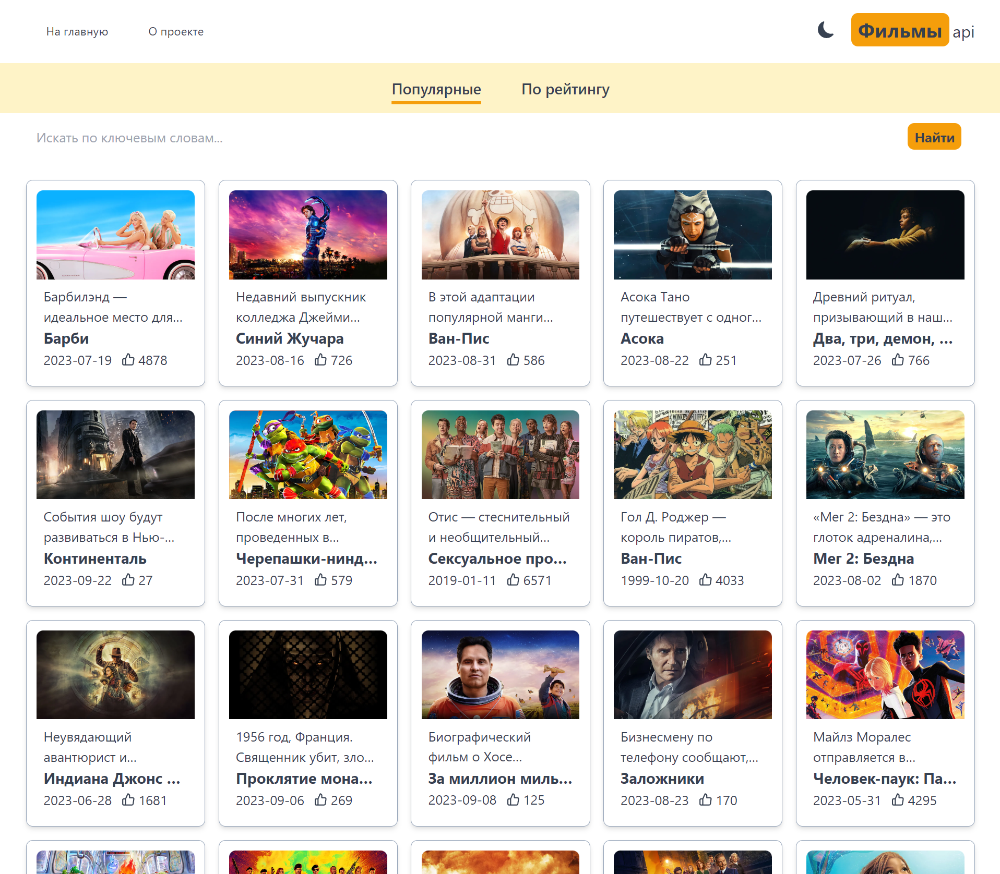

#[IMDB Movie Gallery](https://movie-gallery-next13-latest.vercel.app/)

- Next.js 13
- Tailwind CSS 
- TMBD database api https://www.themoviedb.org/

Основная цель проекта - демонстрация и усовершенствование своих технологических навыков
и знаний веб-разработки на Next.js 13.

Дополнительная цель проекта - предоставить любителям кино возможность быстро и удобно находить 
нужную информацию о любимых фильмах и актерах, а также делиться своими впечатлениями и мнениями с другими пользователями.

Next.js - это инструмент для разработки веб-приложений, который позволяет создавать высокопроизводительные приложения
с помощью React и Node.js.

Представляю IMDB Clone - Ваш идеальный спутник в мире кино!

Почувствуйте волшебство большого экрана, как никогда раньше, с этим современным клоном IMDB, созданным мной на Next.js 13. Я использовал мощь базы данных TMBD, чтобы предоставить вам неповторимое кинематографическое путешествие. Исследуйте мир фильмов и телешоу легко и удобно благодаря стильному и интуитивному пользовательскому интерфейсу, созданному мной.

Особенности:

Интеграция с базой данных TMBD: Получите доступ к обширному сокровищу информации о фильмах и телешоу прямо у вас под рукой. Моя интеграция с базой данных TMBD обеспечивает актуальную информацию о последних релизах, подробностях о актерах, обзорах и многом другом.

Стиль Tailwind CSS: Подготовьтесь к визуальному восхищению благодаря потрясающему дизайну, созданному мной. IMDB Clone стилизован с помощью современного и универсального фреймворка Tailwind CSS, создавая визуально привлекательный и адаптивный пользовательский опыт.

Мощный поиск и фильтры: Найдите свои любимые фильмы и телешоу легко с функцией поиска. Вы также можете фильтровать фильмы по рейтингу и дате выпуска, чтобы открывать новые шедевры и классику.

С IMDB Clone (Next.js 13), я переосмыслил ваше взаимодействие с миром кино. Открывайте, обзор, и погружайтесь в мир развлечений, как никогда раньше. Это больше, чем просто клон известного ресурса, это ваш кинематографический спутник.

    ========

The main goal of the project is to demonstrate and improve one's technological skills
and knowledge of web development on Next.js 13.

An additional goal of the project is to provide movie lovers with an opportunity to quickly and conveniently find
information about their favorite movies and actors, as well as share their impressions and opinions with other users.

Next.js is a web application development tool that allows you to create high-performance applications
using React and Node.js.

Introducing IMDB Clone - your perfect companion in the world of movies!

Experience the magic of the big screen like never before with this modern IMDB clone I created in Next.js 13. I've harnessed the power of the TMBD database to give you a unique cinematic journey. Explore the world of movies and TV shows easily and conveniently with a stylish and intuitive user interface created by me.

Features:

TMBD Database Integration: Access a vast treasure trove of movie and TV show information right at your fingertips. My TMBD database integration provides up-to-date information on the latest releases, cast details, reviews and more.

Tailwind CSS Style: Prepare to be visually delighted with a stunning design created by me. IMDB Clone is styled using the modern and versatile Tailwind CSS framework, creating a visually appealing and adaptive user experience.

Powerful search and filters: Find your favorite movies and TV shows easily with the search function. You can also filter movies by rating and release date to discover new masterpieces and classics.

With IMDB Clone (Next.js 13), I've redefined your interaction with the movie world. Discover, review, and immerse yourself in the world of entertainment like never before. It's more than just a clone of a well-known resource, it's your cinematic companion.

