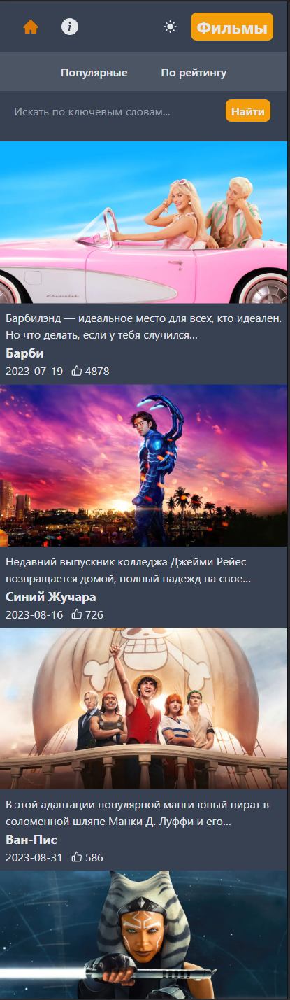

https://movie-gallery-next13-latest.vercel.app/

Представляю IMDB Clone (Next.js 13) - Ваш идеальный спутник в мире кино!

Почувствуйте волшебство большого экрана, как никогда раньше, с этим современным клоном IMDB, созданным мной на Next.js 13. Я использовал мощь базы данных TMBD, чтобы предоставить вам неповторимое кинематографическое путешествие. Исследуйте мир фильмов и телешоу легко и удобно благодаря стильному и интуитивному пользовательскому интерфейсу, созданному мной.

Особенности:

Интеграция с базой данных TMBD: Получите доступ к обширному сокровищу информации о фильмах и телешоу прямо у вас под рукой. Моя интеграция с базой данных TMBD обеспечивает актуальную информацию о последних релизах, подробностях о актерах, обзорах и многом другом.

Стиль Tailwind CSS: Подготовьтесь к визуальному восхищению благодаря потрясающему дизайну, созданному мной. IMDB Clone стилизован с помощью современного и универсального фреймворка Tailwind CSS, создавая визуально привлекательный и адаптивный пользовательский опыт.

Мощный поиск и фильтры: Найдите свои любимые фильмы и телешоу легко с функцией поиска. Вы также можете фильтровать фильмы по рейтингу и дате выпуска, чтобы открывать новые шедевры и классику.

С IMDB Clone (Next.js 13), я переосмыслил ваше взаимодействие с миром кино. Открывайте, обзор, и погружайтесь в мир развлечений, как никогда раньше. Это больше, чем просто клон известного ресурса, это ваш кинематографический спутник.

================================================================================================

Introducing IMDB Clone (Next.js 13) - Your Ultimate Film Companion!

Experience the magic of the silver screen like never before with this cutting-edge IMDB Clone, crafted by me on Next.js 13. I've harnessed the power of the TMBD database to bring you an unparalleled cinematic journey. Explore the world of movies and TV shows with ease, thanks to the sleek and intuitive user interface I've designed.

Key Features:

TMBD Database Integration: Access a vast treasure trove of movie and TV show information right at your fingertips. My integration with the TMBD database ensures that you stay up-to-date with the latest releases, cast details, reviews, and more.

Tailwind CSS Styling: Prepare to be visually captivated by the stunning design I've crafted. IMDB Clone is styled with the modern and versatile Tailwind CSS framework, creating a visually appealing and responsive user experience.

Powerful Search and Filters: Find your favorite movies and TV shows effortlessly with the search feature. You can also filter movies by rating and release date to discover new gems and classics alike.

With IMDB Clone (Next.js 13), I've redefined how you interact with the world of cinema. Discover, review, and immerse yourself in the world of entertainment like never before. It's more than just a clone; it's your cinematic companion."
